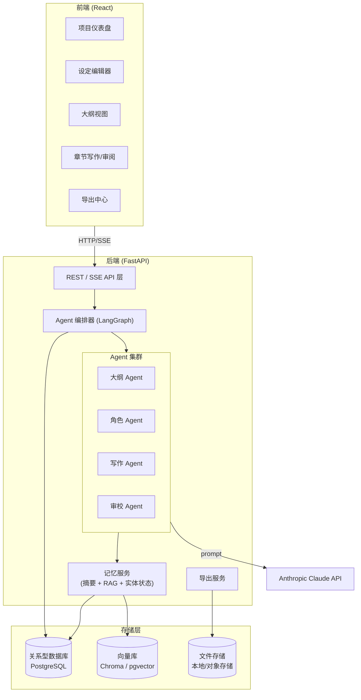
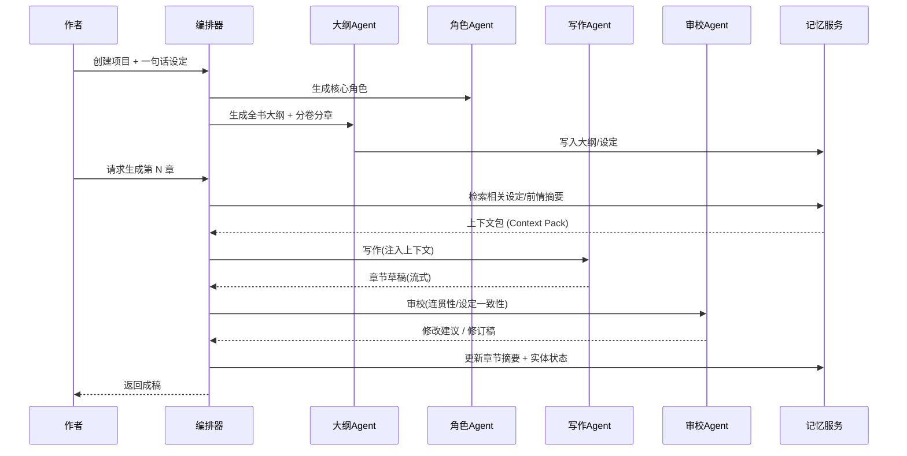
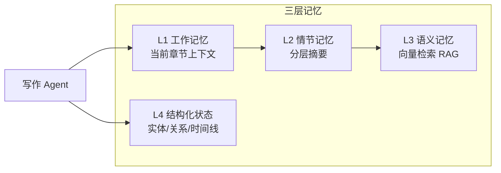
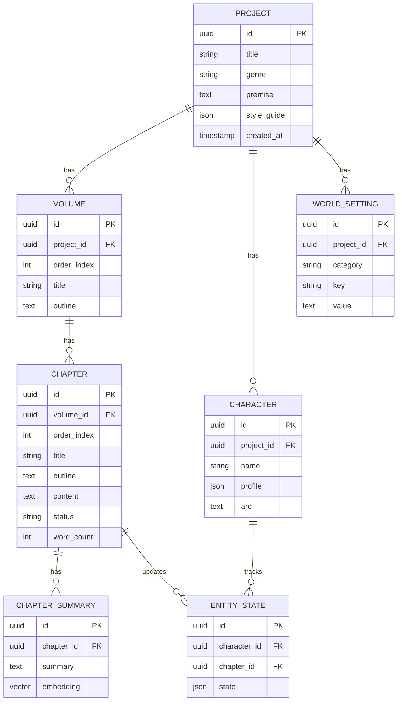

# AI Agent 小说写作系统 — 架构设计文档

> 版本: v0.5
> 技术栈: Python (FastAPI) 后端 + React 前端 + Anthropic Claude (支持自定义兼容端点)
> 状态: 阶段 1–4 已落地，阶段 5 进行中

---

## 1. 项目目标

构建一个由多个 AI Agent 协作完成长篇小说创作的系统。系统需要解决长篇创作中最核心的三个难题：

1. **连贯性** — 跨章节的情节、人物、伏笔保持一致，不"前后矛盾"。
2. **长程记忆** — 在 LLM 上下文窗口有限的前提下，让 Agent "记住"几十万字的设定与剧情。
3. **可控性** — 作者能在大纲、设定、章节各层级介入、修改、重生成。

### 核心功能清单

| 功能 | 说明 |
| --- | --- |
| 多 Agent 协作 | 大纲师 / 角色师 / 写作师 / 审校师 分工协作 |
| 世界观 & 角色设定管理 | 结构化存储，可增删改查，写作时自动注入 |
| 章节连贯性 & 长程记忆 | 剧情摘要 + 向量检索 (RAG) + 实体状态追踪 |
| Web 可视化界面 | 项目管理、设定编辑、章节生成与审阅 |
| 导出 | Markdown / EPUB / Word (.docx) |

---

## 2. 总体架构



### 分层说明

- **前端 (React)**：纯展示与交互，通过 REST 调用 + SSE 流式接收 Agent 生成内容。
- **API 层 (FastAPI)**：鉴权、请求校验、任务编排入口、SSE 推流。
- **编排器 (LangGraph)**：定义 Agent 之间的工作流（状态机/图），管理多轮协作。
- **Agent 集群**：每个 Agent 是"系统提示词 + 工具集 + 记忆访问"的组合。
- **记忆服务**：系统的"大脑"，负责把长篇内容压缩、检索、注入。
- **存储层**：结构化数据用 PostgreSQL，语义检索用向量库，成稿文件落地存储。

---

## 3. 多 Agent 设计

采用 **编排式 (Orchestrator-driven)** 而非完全自主，保证可控与可调试。



### 各 Agent 职责

| Agent | 输入 | 输出 | 关键提示词要点 |
| --- | --- | --- | --- |
| **大纲 Agent** | 题材、设定、篇幅 | 分卷/分章大纲、剧情节点、伏笔表 | 三幕结构、节奏控制、伏笔回收 |
| **角色 Agent** | 故事背景 | 角色卡(性格/动机/关系/弧光) | 立体化、动机一致、关系网 |
| **写作 Agent** | 章节大纲 + 上下文包 | 章节正文 | 文风一致、show-not-tell、对话自然 |
| **审校 Agent** | 草稿 + 设定 + 前情 | 一致性报告 + 修订 | 检测矛盾、人设崩坏、伏笔遗漏 |

> 设计原则：每个 Agent 单一职责，便于独立替换提示词、独立评测、独立重试。

---

## 4. 长程记忆方案（系统核心）

长篇小说远超 Claude 上下文窗口，需多层记忆协同。



### 4.1 分层摘要 (Hierarchical Summary)
- 每章生成后产出 **章节摘要**（200~400 字）。
- 每卷结束生成 **卷摘要**（聚合章节摘要）。
- 写作时注入：当前卷摘要 + 最近 2~3 章详细摘要 + 上一章结尾原文。

### 4.2 向量检索 (RAG)
- 把设定条目、角色卡、历史章节切片向量化存入向量库。
- 写作前根据"当前章节大纲"做语义检索，召回最相关的 K 条历史片段（如某伏笔、某配角首次登场）。

### 4.3 结构化实体状态追踪
- 维护实体状态表：角色当前位置、状态(生/死/受伤)、持有物、关系变化、已知信息。
- 每章审校后由 Agent 抽取"状态变更"并更新，避免"已死角色复活"类错误。

### 4.4 上下文包 (Context Pack)
写作 Agent 实际收到的上下文 = 
```
世界观摘要 + 相关角色卡 + 本章大纲 + 卷摘要 
+ 最近章节摘要 + RAG 召回片段 + 相关实体当前状态 + 上一章结尾原文
```

---

## 5. 数据模型



---

## 6. 技术选型

### 后端
| 用途 | 选型 | 备注 |
| --- | --- | --- |
| Web 框架 | FastAPI | 异步、SSE、自动文档 |
| Agent 编排 | LangGraph | 状态机式多 Agent 工作流 |
| LLM SDK | `anthropic` 官方 SDK | Claude 流式输出 |
| ORM | SQLAlchemy 2.0 + Alembic | 迁移管理 |
| 数据库 | PostgreSQL | 可用 SQLite 起步 |
| 向量库 | pgvector 或 Chroma | 起步用 Chroma 更简单 |
| 任务队列 | (可选) Celery/RQ | 长章节生成异步化 |
| 导出 | `python-docx` / `ebooklib` / markdown | docx / epub / md |

### 前端
| 用途 | 选型 |
| --- | --- |
| 框架 | React + Vite + TypeScript |
| 状态管理 | TanStack Query + Zustand |
| UI | Tailwind CSS + shadcn/ui |
| 编辑器 | TipTap (富文本) 或 Markdown 编辑器 |
| 流式接收 | EventSource (SSE) |

---

## 7. 推荐目录结构

```
NovelWritter/
├── backend/
│   ├── app/
│   │   ├── main.py                 # FastAPI 入口
│   │   ├── config.py               # 配置/环境变量
│   │   ├── api/                    # 路由层
│   │   │   ├── projects.py
│   │   │   ├── chapters.py
│   │   │   ├── settings.py
│   │   │   └── generate.py         # SSE 生成端点
│   │   ├── agents/                 # Agent 定义
│   │   │   ├── base.py
│   │   │   ├── outline_agent.py
│   │   │   ├── character_agent.py
│   │   │   ├── writer_agent.py
│   │   │   └── reviewer_agent.py
│   │   ├── orchestrator/           # LangGraph 工作流
│   │   │   └── graph.py
│   │   ├── memory/                 # 记忆服务
│   │   │   ├── summarizer.py
│   │   │   ├── retriever.py        # RAG
│   │   │   └── entity_tracker.py
│   │   ├── models/                 # SQLAlchemy 模型
│   │   ├── schemas/                # Pydantic DTO
│   │   ├── services/               # 业务逻辑
│   │   │   └── export.py
│   │   └── llm/
│   │       └── claude_client.py    # Claude 封装
│   ├── alembic/
│   ├── tests/
│   ├── pyproject.toml
│   └── .env.example
├── frontend/
│   ├── src/
│   │   ├── pages/
│   │   ├── components/
│   │   ├── api/                    # 后端调用封装
│   │   ├── hooks/
│   │   └── store/
│   ├── package.json
│   └── vite.config.ts
├── docs/
│   └── architecture.md             # 本文档
└── README.md
```

---

## 8. 关键 API 草案

| 方法 | 路径 | 说明 |
| --- | --- | --- |
| POST | `/projects` | 创建项目(题材+一句话设定) |
| GET | `/projects/{id}` | 项目详情 |
| POST | `/projects/{id}/characters/generate` | 角色 Agent 生成角色 |
| POST | `/projects/{id}/outline/generate` | 大纲 Agent 生成大纲 |
| GET/PUT | `/settings/{id}` | 设定增删改查 |
| POST | `/chapters/{id}/generate` | **SSE** 写作+审校流式生成 |
| POST | `/chapters/{id}/review` | 单独触发审校 |
| GET | `/projects/{id}/export?format=epub` | 导出 |

### SSE 生成事件示例
```
event: status   data: {"stage":"retrieving_context"}
event: status   data: {"stage":"writing"}
event: token    data: {"text":"夜色如墨，"}
event: status   data: {"stage":"reviewing"}
event: review   data: {"issues":[...]}
event: done     data: {"chapter_id":"...","word_count":3200}
```

---

## 9. 分阶段实施路线


| 阶段 | 目标 | 交付物 | 状态 |
| --- | --- | --- | --- |
| **1. MVP** | 跑通 Claude 写一章 | FastAPI + Claude 流式端点 + 最简前端 | ✅ 已完成 |
| **2. 结构化** | 项目/设定/大纲 CRUD | 数据库模型 + 大纲/角色 Agent | ✅ 已完成 |
| **3. 记忆** | 摘要 + RAG + 实体状态 | 记忆服务（L2/L3/L4）、上下文包 | ✅ 已完成 |
| **4. 审校** | 审校闭环、一致性检测 | 审校 Agent + ChapterReview 表 + SSE reviewed | ✅ 已完成 |
| **5. 审改+去AI味** | 自动修订循环 + 去 AI 味 | 修订 Agent、reviewer 加 ai_flavor 维度、写手 prompt 去味、AIGC 检测 | 🚧 进行中 |
| **6. 拆书续写** | 导入已有作品 + 文风仿写 | 拆书逆向 Agent、文风指纹分析/注入 | ⏳ 计划 |
| **7. 产品化** | 伏笔追踪 + 导出 + UX | 伏笔/支线追踪表、导出(MD/EPUB)、整书阅读/就地编辑 | ⏳ 计划 |

> 对标参考：[InkOS](https://github.com/Narcooo/inkos)（多 Agent 写→审→改 + 7 真相文件 + 去 AI 味 + 拆书）。本路线图阶段 5–7 即针对与其的能力差距制定。

### 已完成能力（阶段 1–4）

- **多 Agent**：大纲 / 角色 / 写作 / 审校 Agent，tool-use 结构化输出。
- **三层记忆**：L2 分层摘要（卷/章）、L3 关键词 RAG（无嵌入降级方案，接口可换向量）、L4 实体状态追踪。
- **上下文包**：写作时注入设定/角色/卷纲/前情/召回/实体状态。
- **审校闭环**：成稿→记忆→审校，产出结构化一致性报告（矛盾/人设/情节/伏笔/文风 + 严重度），落库并可单独重审。
- **LLM 接入**：通过 `ANTHROPIC_BASE_URL` 接入官方 API 或任意 Anthropic 兼容端点，模型可动态选择。

### 待补能力（阶段 5–7，对标 InkOS）

| 缺口 | 说明 | 落在 |
| --- | --- | --- |
| 审→**改**自动闭环 | 现仅产报告不自动改；需 Reviser 按 issues 定向改写→再审（可配轮数） | 阶段 5 |
| **去 AI 味** | 写手 prompt 注入疲劳词表/禁用句式/文风指纹；审校加 ai_flavor 维度；anti-detect 改写 | 阶段 5 |
| **拆书/续写** | 导入已有小说，逆向出设定/角色/实体/伏笔，无缝续写 | 阶段 6 |
| **文风仿写** | 分析参考文本提统计指纹（句长/词频/节奏）并注入 | 阶段 6 |
| **伏笔/支线追踪** | 结构化 Foreshadow 表（open/progressing/resolved），写作注入待回收、审校查停滞 | 阶段 7 |
| **资源/情感线** | 资源账本、情感弧线结构化追踪（对应 InkOS 真相文件） | 阶段 7 |
| **导出** | Markdown / EPUB 一键导出 | 阶段 7 |
| **UX** | 整书阅读视图、章节就地编辑、进度/字数看板 | 阶段 7 |

---

## 10. 风险与对策

| 风险 | 对策 |
| --- | --- |
| 上下文超限/成本高 | 分层摘要 + RAG 精准召回，控制注入量 |
| 设定前后矛盾 | 结构化实体状态 + 审校 Agent 强制校验 |
| 文风漂移 | style_guide 固定注入 + few-shot 风格样例 |
| 生成慢/超时 | SSE 流式 + 异步任务队列 |
| LLM 输出格式不稳定 | 结构化输出(JSON schema/tool use)约束 |
| 内容安全/版权 | 输入输出审查、用户数据隔离 |

---

## 11. 下一步

确认本设计后，建议从**阶段 1 (MVP)** 开始：
1. 初始化 `backend/`：FastAPI + `anthropic` SDK + 一个 `/chapters/generate` SSE 端点。
2. 初始化 `frontend/`：Vite + React，一个能输入提示、流式显示生成结果的页面。
3. 打通端到端后，再逐步加入数据库、设定管理、记忆系统。

> 告诉我"开始阶段 1"，我就为你生成可运行的项目脚手架与核心代码。
