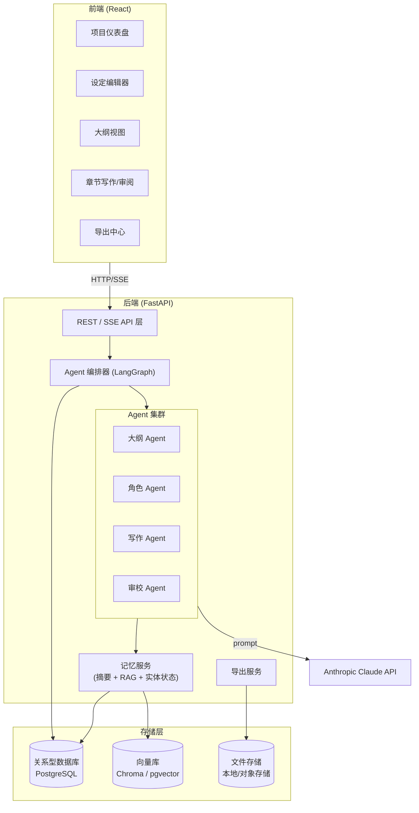
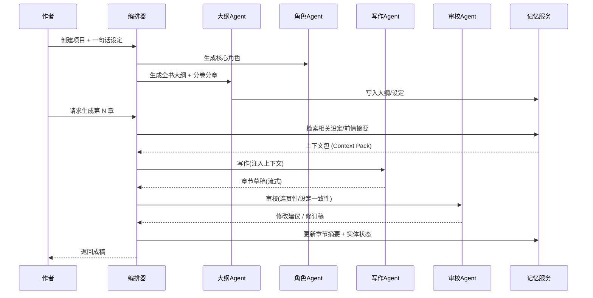
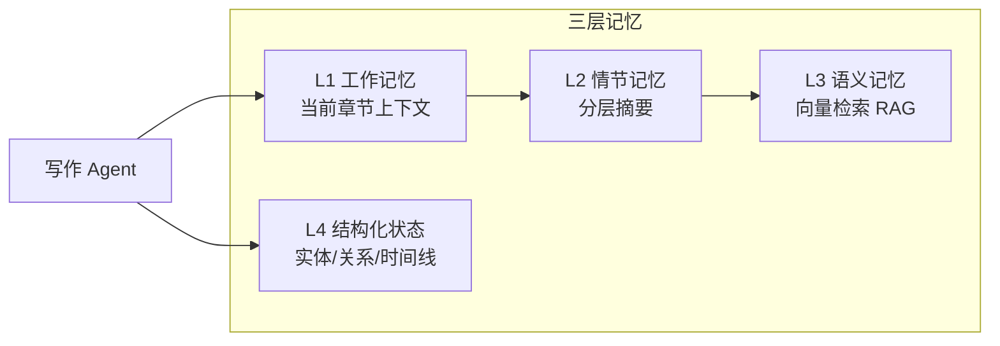
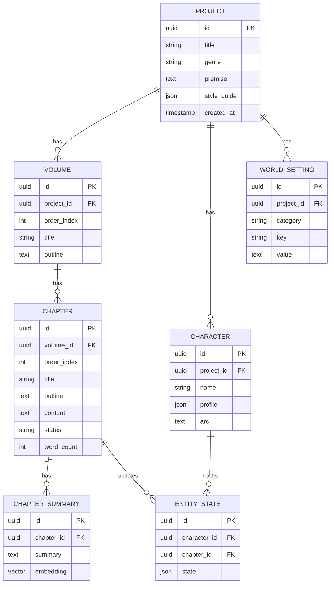

# AI Agent 小说写作系统 — 架构设计文档

> 版本: v0.5
> 技术栈: Python (FastAPI) 后端 + React 前端 + Anthropic Claude (支持自定义兼容端点)
> 状态: 阶段 1–6 已落地，阶段 7 产品化子项持续推进（伏笔追踪含自动停滞检测）

---

## 1. 项目目标

构建一个由多个 AI Agent 协作完成长篇小说创作的系统。系统需要解决长篇创作中最核心的三个难题：

1. **连贯性** — 跨章节的情节、人物、伏笔保持一致，不"前后矛盾"。
2. **长程记忆** — 在 LLM 上下文窗口有限的前提下，让 Agent "记住"几十万字的设定与剧情。
3. **可控性** — 作者能在大纲、设定、章节各层级介入、修改、重生成。

### 核心功能清单

| 功能 | 说明 |
| --- | --- |
| 多 Agent 协作 | 大纲师 / 角色师 / 写作师 / 审校师 分工协作 |
| 世界观 & 角色设定管理 | 结构化存储，可增删改查，写作时自动注入 |
| 章节连贯性 & 长程记忆 | 剧情摘要 + 向量检索 (RAG) + 实体状态追踪 |
| Web 可视化界面 | 项目管理、设定编辑、章节生成与审阅 |
| 导出 | Markdown / EPUB / Word (.docx) |

---

## 2. 总体架构



### 分层说明

- **前端 (React)**：纯展示与交互，通过 REST 调用 + SSE 流式接收 Agent 生成内容。
- **API 层 (FastAPI)**：鉴权、请求校验、任务编排入口、SSE 推流。
- **编排器 (LangGraph)**：定义 Agent 之间的工作流（状态机/图），管理多轮协作。
- **Agent 集群**：每个 Agent 是"系统提示词 + 工具集 + 记忆访问"的组合。
- **记忆服务**：系统的"大脑"，负责把长篇内容压缩、检索、注入。
- **存储层**：结构化数据用 PostgreSQL，语义检索用向量库，成稿文件落地存储。

---

## 3. 多 Agent 设计

采用 **编排式 (Orchestrator-driven)** 而非完全自主，保证可控与可调试。



### 各 Agent 职责

| Agent | 输入 | 输出 | 关键提示词要点 |
| --- | --- | --- | --- |
| **大纲 Agent** | 题材、设定、篇幅 | 分卷/分章大纲、剧情节点、伏笔表 | 三幕结构、节奏控制、伏笔回收 |
| **角色 Agent** | 故事背景 | 角色卡(性格/动机/关系/弧光) | 立体化、动机一致、关系网 |
| **写作 Agent** | 章节大纲 + 上下文包 | 章节正文 | 文风一致、show-not-tell、对话自然 |
| **审校 Agent** | 草稿 + 设定 + 前情 | 一致性报告 + 修订 | 检测矛盾、人设崩坏、伏笔遗漏 |

> 设计原则：每个 Agent 单一职责，便于独立替换提示词、独立评测、独立重试。

---

## 4. 长程记忆方案（系统核心）

长篇小说远超 Claude 上下文窗口，需多层记忆协同。



### 4.1 分层摘要 (Hierarchical Summary)
- 每章生成后产出 **章节摘要**（200~400 字）。
- 每卷结束生成 **卷摘要**（聚合章节摘要）。
- 写作时注入：当前卷摘要 + 最近 2~3 章详细摘要 + 上一章结尾原文。

### 4.2 向量检索 (RAG)
- 把设定条目、角色卡、历史章节切片向量化存入向量库。
- 写作前根据"当前章节大纲"做语义检索，召回最相关的 K 条历史片段（如某伏笔、某配角首次登场）。

### 4.3 结构化实体状态追踪
- 维护实体状态表：角色当前位置、状态(生/死/受伤)、持有物、关系变化、已知信息。
- 每章审校后由 Agent 抽取"状态变更"并更新，避免"已死角色复活"类错误。

### 4.4 上下文包 (Context Pack)
写作 Agent 实际收到的上下文 = 
```
世界观摘要 + 相关角色卡 + 本章大纲 + 卷摘要 
+ 最近章节摘要 + RAG 召回片段 + 相关实体当前状态 + 上一章结尾原文
```

---

## 5. 数据模型



---

## 6. 技术选型

### 后端
| 用途 | 选型 | 备注 |
| --- | --- | --- |
| Web 框架 | FastAPI | 异步、SSE、自动文档 |
| Agent 编排 | LangGraph | 状态机式多 Agent 工作流 |
| LLM SDK | `anthropic` 官方 SDK | Claude 流式输出 |
| ORM | SQLAlchemy 2.0 + Alembic | 迁移管理 |
| 数据库 | PostgreSQL | 可用 SQLite 起步 |
| 向量库 | pgvector 或 Chroma | 起步用 Chroma 更简单 |
| 任务队列 | (可选) Celery/RQ | 长章节生成异步化 |
| 导出 | `python-docx` / `ebooklib` / markdown | docx / epub / md |

### 前端
| 用途 | 选型 |
| --- | --- |
| 框架 | React + Vite + TypeScript |
| 状态管理 | TanStack Query + Zustand |
| UI | Tailwind CSS + shadcn/ui |
| 编辑器 | TipTap (富文本) 或 Markdown 编辑器 |
| 流式接收 | EventSource (SSE) |

---

## 7. 推荐目录结构

```
NovelWritter/
├── backend/
│   ├── app/
│   │   ├── main.py                 # FastAPI 入口
│   │   ├── config.py               # 配置/环境变量
│   │   ├── api/                    # 路由层
│   │   │   ├── projects.py
│   │   │   ├── chapters.py
│   │   │   ├── settings.py
│   │   │   └── generate.py         # SSE 生成端点
│   │   ├── agents/                 # Agent 定义
│   │   │   ├── base.py
│   │   │   ├── outline_agent.py
│   │   │   ├── character_agent.py
│   │   │   ├── writer_agent.py
│   │   │   └── reviewer_agent.py
│   │   ├── orchestrator/           # LangGraph 工作流
│   │   │   └── graph.py
│   │   ├── memory/                 # 记忆服务
│   │   │   ├── summarizer.py
│   │   │   ├── retriever.py        # RAG
│   │   │   └── entity_tracker.py
│   │   ├── models/                 # SQLAlchemy 模型
│   │   ├── schemas/                # Pydantic DTO
│   │   ├── services/               # 业务逻辑
│   │   │   └── export.py
│   │   └── llm/
│   │       └── claude_client.py    # Claude 封装
│   ├── alembic/
│   ├── tests/
│   ├── pyproject.toml
│   └── .env.example
├── frontend/
│   ├── src/
│   │   ├── pages/
│   │   ├── components/
│   │   ├── api/                    # 后端调用封装
│   │   ├── hooks/
│   │   └── store/
│   ├── package.json
│   └── vite.config.ts
├── docs/
│   └── architecture.md             # 本文档
└── README.md
```

---

## 8. 关键 API 草案

| 方法 | 路径 | 说明 |
| --- | --- | --- |
| POST | `/projects` | 创建项目(题材+一句话设定) |
| GET | `/projects/{id}` | 项目详情 |
| POST | `/projects/{id}/characters/generate` | 角色 Agent 生成角色 |
| POST | `/projects/{id}/characters` | 人工新增角色卡（同步 MemoryChunk） |
| PUT/DELETE | `/projects/characters/{id}` | 人工编辑/删除角色卡（同步 MemoryChunk） |
| POST | `/projects/{id}/outline/generate` | 大纲 Agent 生成大纲 |
| PUT | `/projects/chapters/{id}/outline` | 人工编辑章节标题/大纲 |
| GET/PUT | `/settings/{id}` | 设定增删改查 |
| GET/POST | `/projects/{id}/foreshadows` | 伏笔/支线追踪增查 |
| PUT/DELETE | `/foreshadows/{id}` | 伏笔/支线追踪改删 |
| POST | `/chapters/{id}/foreshadows/extract` | 从本章正文抽取伏笔/支线候选项（仅建议，人工确认后登记） |
| POST | `/chapters/{id}/generate` | **SSE** 写作+审校流式生成 |
| POST | `/chapters/{id}/review` | 单独触发审校 |
| POST | `/chapters/{id}/tracking/suggest` | 根据章节正文建议伏笔/支线状态 |
| POST | `/projects/{id}/tracking/stall-scan` | 扫描长期停滞的伏笔/支线，返回风险与状态建议 |
| POST | `/projects/{id}/tracking/batch-status` | 批量应用伏笔/支线状态建议 |
| POST | `/projects/{id}/health-check` | 长篇一键体检：整合停滞检测+真相一致性检查，返回健康评分与问题概览 |
| GET | `/projects/{id}/export?format=markdown&include_metadata=true&include_reviews=false&include_references=false&include_drafts=true` | Markdown 可配置导出 |
| GET | `/projects/{id}/export?format=epub&include_metadata=true&include_reviews=false&include_references=false&include_drafts=true` | EPUB 可配置导出 |

### SSE 生成事件示例
```
event: status   data: {"stage":"retrieving_context"}
event: status   data: {"stage":"writing"}
event: token    data: {"text":"夜色如墨，"}
event: status   data: {"stage":"reviewing"}
event: review   data: {"issues":[...]}
event: done     data: {"chapter_id":"...","word_count":3200}
```

---

## 9. 分阶段实施路线


| 阶段 | 目标 | 交付物 | 状态 |
| --- | --- | --- | --- |
| **1. MVP** | 跑通 Claude 写一章 | FastAPI + Claude 流式端点 + 最简前端 | ✅ 已完成 |
| **2. 结构化** | 项目/设定/大纲 CRUD | 数据库模型 + 大纲/角色 Agent | ✅ 已完成 |
| **3. 记忆** | 摘要 + RAG + 实体状态 | 记忆服务（L2/L3/L4）、上下文包 | ✅ 已完成 |
| **4. 审校** | 审校闭环、一致性检测 | 审校 Agent + ChapterReview 表 + SSE reviewed | ✅ 已完成 |
| **5. 审改+去AI味** | 自动修订循环 + 去 AI 味 | 修订 Agent、reviewer 加 ai_flavor 维度、写手 prompt 去味、AIGC 检测 | ✅ 已完成 |
| **6. 拆书续写** | 导入已有作品 + 文风仿写 | 参考文本分析 Agent、文风指纹分析/注入、本地统计指纹、样例片段库、设定/角色/线索导入、重复/冲突检查、分章导入为参考资料、实体状态时间线、续写起点选择、生成上下文预览、召回命中解释与来源跳转 | ✅ 核心闭环完成 |
| **7. 产品化** | 伏笔追踪 + 真相文件 + 导出 + UX | 伏笔/支线追踪表、长篇真相文件、导出(MD/EPUB)、整书阅读/就地编辑、进度/字数看板 | 🚧 伏笔追踪（含自动停滞检测）+ 真相文件 + UX + 导出子项已完成 |

> 对标参考：[InkOS](https://github.com/Narcooo/inkos)（多 Agent 写→审→改 + 7 真相文件 + 去 AI 味 + 拆书）。本路线图阶段 5–7 即针对与其的能力差距制定。

### 已完成能力（阶段 1–5 + 阶段 6/7 部分）

- **多 Agent**：大纲 / 角色 / 写作 / 审校 Agent，tool-use 结构化输出。
- **三层记忆**：L2 分层摘要（卷/章）、L3 关键词 RAG（无嵌入降级方案，接口可换向量）、L4 实体状态追踪。
- **上下文包**：写作时注入设定/角色/卷纲/前情/召回/实体状态。
- **审校闭环**：成稿→记忆→审校，产出结构化一致性报告（矛盾/人设/情节/伏笔/文风 + 严重度），落库并可单独重审。
- **审改闭环**：按 high/medium issues 自动修订并再审，支持手动自动修订与去 AI 味改写。
- **去 AI 味**：写手/修订 prompt 注入疲劳词与禁用句式，审校报告含 `ai_flavor` 维度与本地分数。
- **设定管理闭环**：项目设定可在工作台增删改，写作/审校/修订上下文注入设定，并同步设定检索片段。
- **大纲扩展闭环**：项目工作台可配置新增卷数与目标章数/卷；支持“追加新卷”和“补齐旧卷”，补齐只给章数不足的旧卷追加新章，不删除、不重排已有章节。
- **伏笔/支线追踪**：项目工作台可维护伏笔、支线、资源线、情感线及其状态；追踪项同步 MemoryChunk，并注入写作/审校/修订上下文；成稿章节可生成状态建议，由用户手动应用；总览页提供跨章追踪仪表盘；新增项目级 LLM 自动停滞检测，结合正文卷章扫描长期未推进的线索，返回沉默章数、风险等级、处理动作（提及/推进/回收/删除）与状态建议，支持单条或批量应用；成稿章节可一键从正文抽取伏笔/支线候选项（`POST /chapters/{id}/foreshadows/extract`），人工勾选后登记为追踪项。
- **作品资料人工编辑**：角色卡支持人工新增/编辑/删除（性格、动机、关系、外貌、弧光），并同步 `character` MemoryChunk；章节标题/大纲可在工作台就地编辑；本章生成字数可在 200–6000 之间手动设置，供审校发现的设定矛盾直接回到源头修正。
- **长篇真相文件**：项目总览可维护硬约束、资源账本、关系弧、隐藏真相和时间锚点；`truth_files` 独立表与 CRUD API 同步 `truth_file` MemoryChunk，并注入大纲生成/补齐、章节生成、审校、修订与上下文预览；总览明确说明它是长期事实库，不会自动变成正文；新增项目级一致性检查，可扫描真相文件与设定、角色、正文卷章之间的明确矛盾，返回证据、来源、严重度、修正建议和维护动作；状态类维护建议支持单条应用、多选批量应用，并会记录最近处理历史；Markdown / EPUB 导出会带上真相文件资料。
- **长篇一键体检**：项目总览提供「长篇一键体检」入口，`POST /projects/{id}/health-check` 串行整合伏笔/支线停滞检测与真相一致性检查，按严重度/风险加权得出 0–100 健康评分与等级（优秀/良好/需关注/偏弱）和问题概览；可处理的明细复用既有停滞与真相维护面板，支持单条/批量应用。
- **参考文本拆书入口**：项目总览可导入 `.txt` / `.md` 文本文件或粘贴参考片段，调用 Reference Agent 提炼文风指纹、设定、角色与伏笔/支线，并用本地统计生成句长、段落、对白占比、标点节奏、高频词/重复风险；分析结果会对照项目已有资料标出重复/可能冲突项，自动写入时只新增非冲突资料，文风指纹注入 `style_guide.style`，统计约束注入 `style_guide.style_stats_prompt`，供后续大纲/写作/审校/修订使用；也可按章节导入为参考资料分组，原文不改写、不计入正文进度/导出，并刷新章节摘要、MemoryChunk 与实体状态时间线；已成稿正文或参考章节可设为续写起点，正式章节详情可预览生成时会注入的锚点、摘要、检索片段和角色状态，召回片段会显示命中关键词、分数与来源跳转。
- **模型选择层级**：全局默认模型来自 `.env` / `.claude/settings.json`；前端右上角提供应用级模型选择，并作为请求覆盖传入项目内角色、大纲、写作、审校、修订、线索建议与拆书分析；后端仍保留 `style_guide.model` 作为未来项目高级覆盖能力。
- **章节就地编辑**：章节正文可在项目工作台手写/编辑，保存后刷新章节摘要、检索片段与实体状态；章节标题/大纲也可单独编辑（不动正文）。
- **整书总览与看板**：项目总览显示总字数、章节进度、审校问题、AI 味均分、整书大纲与整书阅读视图；整书阅读支持按卷、成稿状态、审校风险、AI 味、关键词筛选，可显示未成稿大纲，并可对当前结果批量重审。
- **Markdown / EPUB 导出**：`GET /api/projects/{id}/export?format=markdown|epub` 输出 `.md` / `.epub` 文件；前端工作台提供导出内容面板，可选择是否包含作品资料、未成稿大纲、审校报告和参考资料；参考资料卷默认不导出。
- **LLM 接入**：通过 `ANTHROPIC_BASE_URL` 接入官方 API 或任意 Anthropic 兼容端点，模型可动态选择。
- **本地代理接入**：开发环境可在无 `backend/.env` 时 fallback 读取 `.claude/settings.json` 的 `ANTHROPIC_BASE_URL` / `ANTHROPIC_AUTH_TOKEN` / `ANTHROPIC_MODEL`。

### 待补能力（阶段 5–7，对标 InkOS）

| 缺口 | 说明 | 落在 |
| --- | --- | --- |
| 审→**改**自动闭环 | Reviser 按 issues 定向改写→再审（可配轮数） | 阶段 5 ✅ |
| **去 AI 味** | 写手 prompt 注入疲劳词表/禁用句式；审校加 ai_flavor 维度；anti-detect 改写 | 阶段 5 ✅ |
| **拆书/续写** | 参考文本可逆向出设定/角色/伏笔并写入项目；重复/冲突检查、分章导入为参考资料、实体状态时间线、续写起点选择、生成上下文预览、召回命中解释与来源跳转已完成 | 阶段 6 ✅ |
| **文风仿写** | 已提炼叙述视角、节奏、句式、用词、对白、意象等 LLM 文风指纹并注入；已补本地统计指标（句长、段落、对白、标点、词频/重复风险）和样例片段库 | 阶段 6 ✅ |
| **伏笔/支线追踪** | 结构化 Foreshadow 表、上下文注入、章节状态建议、跨章仪表盘、LLM 自动停滞检测与状态批量应用、从章节正文抽取伏笔候选并登记已完成 | 阶段 7 ✅ |
| **资源/情感线/真相文件** | 已补 `truth_files` 独立表，支持硬约束、资源账本、关系弧、隐藏真相、时间锚点的 CRUD、记忆索引、上下文注入、预览计数、导出、自动矛盾检查、维护建议、单条/批量状态应用和处理记录 | 阶段 7 ✅ |
| **导出** | Markdown / EPUB 一键导出已完成，并支持作品资料、未成稿大纲、审校报告、参考资料的导出细项配置 | 阶段 7 ✅ |
| **UX** | 整书阅读视图、章节就地编辑、进度/字数看板、整书阅读高级筛选与批量重审已完成 | 阶段 7 ✅ |

### 近期实现记录

| 日期 | 能力 | 说明 |
| --- | --- | --- |
| 2026-06-05 | 作品资料人工编辑 + 章节伏笔抽取 | 新增角色卡 CRUD（`POST /projects/{id}/characters`、`PUT/DELETE /projects/characters/{id}`，同步 `character` MemoryChunk）、章节大纲编辑（`PUT /projects/chapters/{id}/outline`）、本章生成字数输入（200–6000），以及从章节正文抽取伏笔候选并人工登记（`POST /chapters/{id}/foreshadows/extract`）；续写上下文预览文案明确标注“只读”。 |
| 2026-06-04 | 长篇一键体检 | 新增 `POST /api/projects/{id}/health-check`；串行整合停滞检测与真相一致性检查，按严重度/风险加权算出 0–100 健康评分与等级，前端总览展示评分卡与问题概览，可处理明细复用既有停滞/真相面板。 |
| 2026-06-04 | 伏笔/支线自动停滞检测 | 新增 `POST /api/projects/{id}/tracking/stall-scan` 与 `tracking/batch-status`；结合正文卷章 LLM 扫描长期停滞线索，返回沉默章数、风险、处理动作与状态建议，前端总览支持单条/批量应用。 |
| 2026-06-03 | 本地 Anthropic 兼容代理接入 | 后端支持从 `.claude/settings.json` 自动读取本地 Anthropic 兼容代理配置，已通过 tool-use 与 API E2E 烟测。 |
| 2026-06-03 | 设定管理闭环 | 前端工作台支持设定增删改；后端同步 `setting` MemoryChunk，并在写作/审校/修订上下文注入设定。 |
| 2026-06-03 | 章节就地编辑 | 新增 `PUT /api/chapters/{id}/content`；保存正文后刷新章节摘要、`chapter_summary` MemoryChunk 与实体状态。 |
| 2026-06-03 | 整书阅读与看板 | 项目总览显示总字数、章节进度、审校问题、AI 味均分，并提供整书阅读视图。 |
| 2026-06-03 | 整书阅读高级筛选 | 整书阅读新增按卷、成稿状态、审校风险、AI 味、关键词筛选；可显示未成稿大纲，当前筛选结果中的成稿章节可勾选后批量重新审校。 |
| 2026-06-03 | Markdown / EPUB 导出 | 新增 `GET /api/projects/{id}/export?format=markdown|epub`；前端项目动作区可一键下载 `.md` / `.epub`，HTTP 烟测覆盖 Markdown 响应与 EPUB 包结构。 |
| 2026-06-03 | 导出内容配置 | 导出接口新增 `include_metadata`、`include_reviews`、`include_references`、`include_drafts` 参数；前端项目动作区新增导出内容面板，可导只含正文的干净稿，也可附带资料设定、审校报告和参考资料，Markdown/EPUB 烟测覆盖组合输出。 |
| 2026-06-03 | 可配置/追加/补齐大纲 | 项目工作台支持填写新增卷数与目标章数/卷；后端二次生成时携带已有大纲上下文并续接卷序；新增 `POST /api/projects/{id}/outline/fill` 非破坏式补齐旧卷；总览页新增整书大纲视图。 |
| 2026-06-03 | 伏笔/支线追踪 | 新增 `foreshadows` 表与 CRUD API；前端工作台支持伏笔/支线/资源线/情感线管理；追踪项同步 MemoryChunk，并注入写作/审校/修订上下文。 |
| 2026-06-03 | 线索状态建议 | 新增 `POST /api/chapters/{id}/tracking/suggest`；成稿章节可分析伏笔/支线是否推进或回收，前端展示证据、理由、置信度，并由用户手动应用状态。 |
| 2026-06-03 | 跨章追踪仪表盘 | 项目总览基于卷章标题、章纲和正文做本地线索命中分析，展示状态分布、跨卷命中、沉默线索和回收计划。 |
| 2026-06-03 | 参考文本拆书入口 | 新增 `POST /api/projects/{id}/reference/analyze` 与 Reference Agent；项目总览可导入 `.txt` / `.md` 或粘贴文本并提炼文风指纹、设定、角色、伏笔/支线，支持自动写入项目与 MemoryChunk。 |
| 2026-06-03 | 全局模型选择 | 前端顶栏右上角新增应用级模型选择器；项目管理与独立写作入口统一使用该选择作为请求覆盖，后端模型解析仍按“请求覆盖 > 项目模型 > 全局默认”。 |
| 2026-06-03 | 分章拆书导入 | 新增 `POST /api/projects/{id}/reference/chapters/import`；可按章节标题切分参考文本，导入为 `reference` 参考资料卷，并逐章生成摘要、检索片段与实体状态时间线。 |
| 2026-06-03 | 参考资料分区 | `Volume.kind` 区分 `novel` 正文卷与 `reference` 参考资料卷；前端左侧分区展示，正文进度、整书阅读、大纲与 Markdown/EPUB 导出默认只处理正文卷。 |
| 2026-06-03 | 导入冲突检查 | `ReferenceAnalyzeResult.conflicts` 返回同名设定/角色/线索的重复或可能冲突项；自动写入时跳过已有项，前端展示“重复跳过/可能冲突”的已有内容与导入内容。 |
| 2026-06-03 | 续写起点选择 | 新增 `PUT /api/projects/{id}/continuation-anchor`；成稿章节可设为续写起点，后续章节生成时注入锚点结尾、摘要与该章实体状态。 |
| 2026-06-03 | 生成上下文预览 | 新增 `GET /api/chapters/{id}/context-preview`；正式章节详情自动展示续写起点、上一章尾巴、最近摘要、RAG 召回、角色状态和资料计数，生成前可核对上下文来源。 |
| 2026-06-03 | 召回命中解释 | 上下文预览中的 RAG 召回返回来源标题、来源类型、命中关键词、召回分数与跳转目标；前端可从召回卡片跳到对应正文/参考章节或项目总览。 |
| 2026-06-03 | 文风统计指纹 | 新增本地 `style_stats` 分析：参考分析/分章导入会统计句长、段落、对白占比、标点节奏、高频词、重复风险并保存到 `style_guide.style_stats`；生成/大纲/审校/修订统一注入统计约束，项目总览展示当前文风指纹。 |
| 2026-06-03 | 文风样例片段库 | `style_stats` 模块新增代表片段抽取，按对白/动作/场景/心理/叙述分类保存到 `style_guide.style_samples`，生成 prompt 注入 few-shot 风格样例并明确只学习节奏句法、不复刻具体情节；项目总览展示当前样例库。 |
| 2026-06-03 | 长篇真相文件 | 新增 `truth_files` 表与 `/api/projects/{id}/truth-files`、`/api/truth-files/{id}` CRUD；项目总览可维护硬约束、资源账本、关系弧、隐藏真相和时间锚点，写大纲/写章节/审校/修订会注入非归档真相文件；上下文预览显示真相数量，RAG 命中可跳回总览；Markdown / EPUB 导出包含真相文件资料。 |
| 2026-06-03 | 真相文件矛盾检查 | 新增 `truth_check_agent` 与 `POST /api/projects/{id}/truth-files/check`；将非归档真相文件、设定、角色、正文卷章摘要/片段组成紧凑资料包，返回明确矛盾的证据、来源、严重度、修正建议和维护动作；项目总览可手动触发检查、跳转来源，并一键应用真相文件状态类建议。 |
| 2026-06-03 | 真相维护批量处理 | 新增 `POST /api/projects/{id}/truth-files/maintenance-log`；维护建议中的状态类动作默认可选，支持全选/取消和批量应用，应用后写入 `style_guide.truth_maintenance_log` 并在总览展示最近处理记录。 |

---

## 10. 风险与对策

| 风险 | 对策 |
| --- | --- |
| 上下文超限/成本高 | 分层摘要 + RAG 精准召回，控制注入量 |
| 设定前后矛盾 | 结构化实体状态 + 审校 Agent 强制校验 |
| 文风漂移 | style_guide 固定注入 + few-shot 风格样例 |
| 模型使用不一致 | 顶栏全局选择 + 后端统一解析器；项目级覆盖保留为高级后备能力 |
| 生成慢/超时 | SSE 流式 + 异步任务队列 |
| LLM 输出格式不稳定 | 结构化输出(JSON schema/tool use)约束 |
| 内容安全/版权 | 输入输出审查、用户数据隔离 |

---

## 11. 下一步

当前建议继续推进**阶段 7 产品化**与长篇一致性：
1. ✅ 长篇一致性：伏笔/支线自动停滞检测与状态批量建议已完成；并已整合为「长篇一键体检」（停滞检测 + 真相一致性检查 + 健康评分）。
2. 稳定性：为导入、生成、审校、导出增加更系统的自动化回归脚本。
3. 产品化：补充更细的导出/阅读回归用例与错误态提示。
